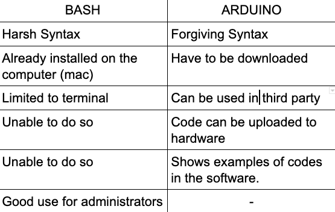
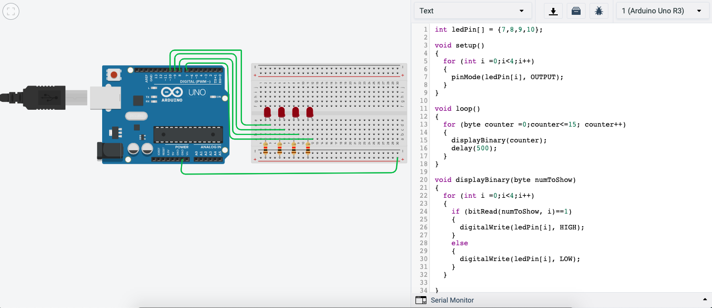
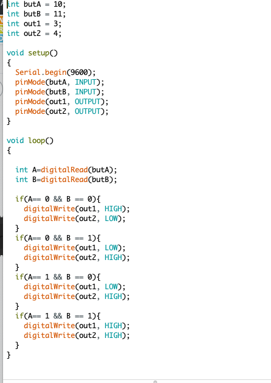

11/November/2019
- Today we improved our understanding of arduino. We learned how to use variables and attempted to make a traffic light using the arduino kit. It is different yet simple when coming from bash. Still have to get used to the syntax.

13/November/2019
- Today we learned how to use LED's in arduino to display binary numbers. So we used TinkerCad to simulate the use of 4 LED's to count in binary from 1 to 15.
http://www.multiwingspan.co.uk/arduino.php?page=led5 

18/November/2019
- Today we learned how to convert binary into decimals and vice versa, we also learned about hexadecimals, it took me a while to understand but I think I have grasped the concept. For homework we had to make an arduino script to push buttons and turn on led's according to a table, heres what I came up with.

- In class we learned the different ways people approached this. First was Filips way, which was to use a lot of if commands. That was much more simpler and easier to understand but meant more lines of code, not converting to decimals, and not scalable. Tom's way was grouping the outputs and saving much more lines, it was harder to understand yet a smarter way to approach it since it was scalable.
- We also learned the different binary gates, including OR, AND, NOT, and XOR. This allows us to make groups of outputs and was used to make codes much shorter and simpler than using a million if commands.

19/November/2019

- Today in class we spend most of our time doing a worksheet on binary gates and K-maps. I somewhat understood how to convert the gate symbols into equations and vice versa but I still have trouble grasping the concept of the Tables and how to read them. I will try to do more research to understand it further.
