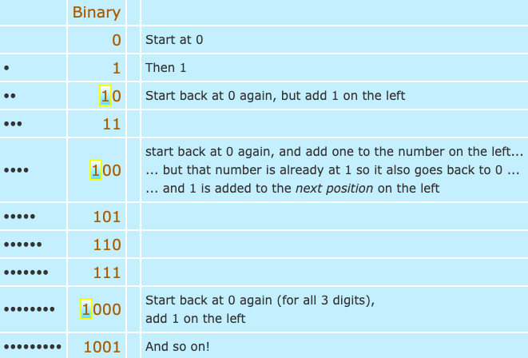
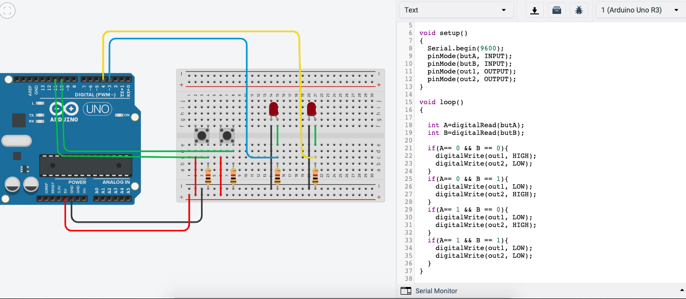

Feedback Nov 26 (You can deleted this section later. It will remain in the history of the file)

|No.|How to improve        |
|-|------------- |
|①| I can understand what you are trying to say with the success criteria, however, better if you can rewrite the sentences to make them cristal clear. **For example:** 2. Morse is able to be translated to English with the Lights => The system is able to translate between English and Morse code| 
|②| Let try to include at least 5 success criteria. They can be small such as: The system uses 100W lights for communication.|
|③| Keep adding pictures, small parts of code, sketches, flow diagrams to your development section. Keep the journal only for reflection which answer the questions: What did we do today in class? What did you learn? to do list.|
|④　|Try to think in different justifications for using Arduino. One reason is that we are learning to use this platform in the classroom. Research about the qualities of an Arduino and that can be the selling point for using it here.|
|⑤|　Add your References at the bottom of the page using MLA format. I have added the section for you to fill in.|

----

# Comsci-Isak-unit-2
This is for all the files and work done for unit 2
Interplanetary Communication
===========================

An application that helps different planets communicate

Contents
-----
  1. [Planning](#planning)
  1. [Design](#design)
  1. [Development](#development)
  1. [Evalution](#evaluation)

Planning
----------
The clients are astronauts. They are currently doing research on the plants Mars and moon. They need to communicate to relay information of what they have discovered on these planets. The signal they have is very limited and slow. In order to adapt to this and communicate they have to use the use different languages to send codes that are short and able to be deciphered. 

The application has to allow for the follwing:
- Communication between Earth and Mars uses Morse code.
- Communication between Mars and the Moon uses Binary code.
- Provide a communication system that allow stations to communicate seamlessly using English.
Keyboard input on each station is limited to 2 push buttons. 
100W lights are buzzers are available.


### Rationale for proposed solution
Since they have to use easy and decipherable languages. We have proposed to use Morse and binary code. We are using Arduino because it is able to use these languages and translate them using LED's using the code. Arduino allows us to make code translating between the languages and also implement the code into a circuit which will then allow these astronauts to communicate.

### Success Criteria
This are measuarable outcomes
1. 2 Push Buttons allow the user to communicate 
1. Morse is able to be translated to English with the Lights
1. Binary is able to be translated to Morse with the lights

Design
---------

Development
--------
How to count from 0 - 15 in binary

When we run out of digits, we start back at 0 again, but add 1 on the left.
https://www.mathsisfun.com/binary-number-system.html 

We learned how to allow LED's to be turned on and off using push buttons


```
int butA = 10;
int butB = 11;
int out1 = 3;
int out2 = 4;

void setup()
{
  Serial.begin(9600);
  pinMode(butA, INPUT);
  pinMode(butB, INPUT);
  pinMode(out1, OUTPUT);
  pinMode(out2, OUTPUT);
}

void loop()
{
  
  int A=digitalRead(butA);
  int B=digitalRead(butB);
  
  if(A== 0 && B == 0){
    digitalWrite(out1, HIGH);
    digitalWrite(out2, LOW);
  }
  if(A== 0 && B == 1){
    digitalWrite(out1, LOW);
    digitalWrite(out2, HIGH);
  }
  if(A== 1 && B == 0){
    digitalWrite(out1, LOW);
    digitalWrite(out2, HIGH);
  }
  if(A== 1 && B == 1){
    digitalWrite(out1, LOW);
    digitalWrite(out2, LOW);
  }
}
```
We had to define the different outputs and inputs, The inputs being butA and butB, which are 10 and 11, as you can see the the green wires connect butA and B to the Arduino UNO on number 10 and 11. The outputs are the 2 LED's which are connected via the yellow and blue wire to number 3 and 4. The LOW means that the LED is off and the HIGH means that the LED is on. 

## References

