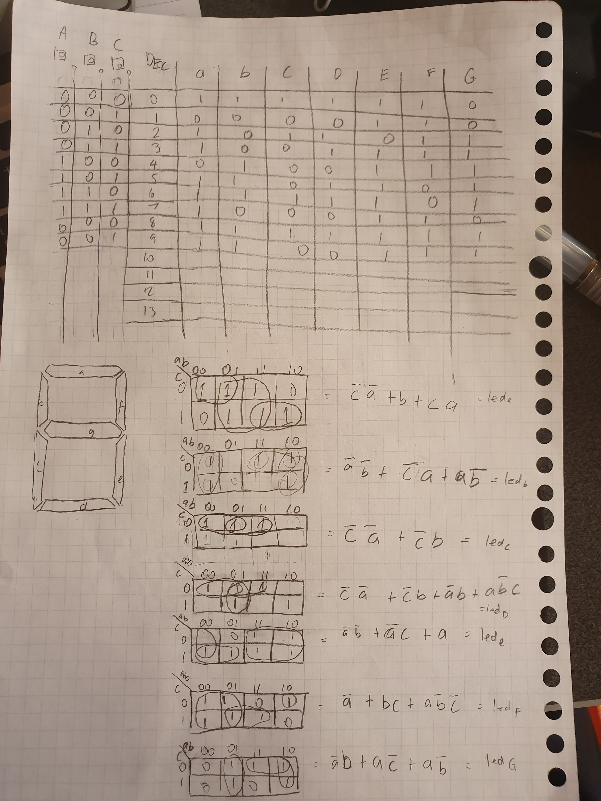
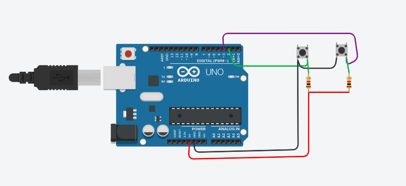

# Comsci-Isak-unit-2
This is for all the files and work done for unit 2
Interplanetary Communication
===========================

An application that helps different planets communicate

Contents
-----
  1. [Planning](#planning)
  1. [Design](#design)
  1. [Development](#development)
  1. [Evalution](#evaluation)

Planning
----------
The clients are astronauts. They are currently doing research on the plants Mars and moon. They need to communicate to relay information of what they have discovered on these planets. The signal they have is very limited and slow. In order to adapt to this and communicate they have to use the use different languages to send codes that are short and able to be deciphered. 

The application has to allow for the follwing:
- Communication between Earth and Mars uses Morse code.
- Communication between Mars and the Moon uses Binary code.
- Provide a communication system that allow stations to communicate seamlessly using English.
Keyboard input on each station is limited to 2 push buttons. 
100W lights are buzzers are available.


### Rationale for proposed solution
Since they have to use easy and decipherable languages. We have proposed to use Morse and binary code. We are using Arduino because it is able to use these languages and translate them using LED's using the code. Arduino allows us to make code translating between the languages and also implement the code into a circuit which will then allow these astronauts to communicate. The reason as to why we are using Arduino is because Arduino software runs on Windows, Macintosh OSX, and Linux operating systems so most computer softwares can run it. Arduino's are also relatively cheap so they reduce the cost for this program to run. 

### Success Criteria
This are measuarable outcomes
1. 2 Push Buttons allow the user to communicate 
2. The system allows Morse to be translated into English with the use of lights.
3. The system allows Binary to be translated into Morse with the use of lights.
4. The system uses 100W lights for communication
5. The buttons allow for Sending, Deleting, Spacing, and digit's as well


Development
--------
Describe the process needed to convert a number from Binary to Decimal:

1. Make a table for 8 spaces and in those spaces put the multiples of 2 starting at 1, from the right to the left.
2. With a binary number, align it with the tables of multiples of 2
3. If the binary number digit is 1, write the corresponding number from the multiples of 2 table below the digit
4. If the binary number digit is 0, then just write 0 below the digit
5. Add all the digits below the binary numbers

we used TinkerCad to simulate the use of 4 LED's to count in binary from 1 to 15.


How to count from 0 - 15 in binary

When we run out of digits, we start back at 0 again, but add 1 on the left.

We learned how to allow LED's to be turned on and off using push buttons


```
int butA = 10;
int butB = 11;
int out1 = 3;
int out2 = 4;

void setup()
{
  Serial.begin(9600);
  pinMode(butA, INPUT);
  pinMode(butB, INPUT);
  pinMode(out1, OUTPUT);
  pinMode(out2, OUTPUT);
}

void loop()
{
  
  int A=digitalRead(butA);
  int B=digitalRead(butB);
  
  if(A== 0 && B == 0){
    digitalWrite(out1, HIGH);
    digitalWrite(out2, LOW);
  }
  if(A== 0 && B == 1){
    digitalWrite(out1, LOW);
    digitalWrite(out2, HIGH);
  }
  if(A== 1 && B == 0){
    digitalWrite(out1, LOW);
    digitalWrite(out2, HIGH);
  }
  if(A== 1 && B == 1){
    digitalWrite(out1, LOW);
    digitalWrite(out2, LOW);
  }
}
```
We had to define the different outputs and inputs, The inputs being butA and butB, which are 10 and 11, as you can see the the green wires connect butA and B to the Arduino UNO on number 10 and 11. The outputs are the 2 LED's which are connected via the yellow and blue wire to number 3 and 4. The LOW means that the LED is off and the HIGH means that the LED is on. 

In class we practiced our skills to make truth tables to display the number 0-7 using led's, here is my work on the truth tables, unfortunately I could not get to the point to code it and practice it


We developed a code to allow the user to input English letters and digits using 2 buttons

```
// add the comments to the header of the program
//This code allows the user to type digit & alphabets using two buttons and gives them the option to send and delete.
String text = "";
int index = 0; 
// add all the letters and digits to the keyboard
String keyboard[]={"A", "B", "C", "D", "E", "F", "G", "H", "I", "J", "K", "L", "M", "N", "O", "P", "Q", "R", "S", "T", "U", "V", "W", "X", "Y", "Z", "1", "2", "3", "4", "5", "6", "7", "8", "9", "0", "SENT", "DEL",};
int numOptions = 38; //size of keyboard

void setup()
{
  Serial.begin(9600);
  attachInterrupt(0, changeLetter, RISING);//button A in port 2
  attachInterrupt(1, selected, RISING);//button B in port 3
}

void loop()
{
  Serial.println("Option (Select:butB, Change:butA): " + keyboard[index]);
  Serial.println("Message: "+ text);
  delay(1000);
}

//This function changes the letter in the keyboard
void changeLetter(){
index++;
//Explain what the functionality of the if condition below 
// The if command here shows that when the loop of letters and numbers are finished; when it cycles through 38 options; it goes back and restarts at 0
  if(index>numOptions){
  	index=0; //loop back to first row
  } 
}

//this function adds the letter to the text or send the msg
void selected(){
  //include the program here represented in the flow diagram in   Fig. 2
String key = keyboard[index];
if(key =="DEL"){
int len= text.length(); text.remove(len-1);
  index=0;}
else if(key=="SEND"){
Serial.println("Message Sent");
text="";
}
else(text += key);{
}
}
```
The way this code works is that the there is an array of letter, digits and options, the buttons allow us to select the them and switch. The code will loop the array and when a button is pressed it goes to the next option until all the options are gone through then it restarts at the first option. 
** Update: the code was looping too fast for me so i increased the delay to 1000.

## References
“MultiWingSpan.” Multiwingspan, http://www.multiwingspan.co.uk/arduino.php?page=led5.

Person, and wikiHow. “How to Convert from Binary to Decimal.” WikiHow, WikiHow, 12 Nov. 2019, https://www.wikihow.com/Convert-from-Binary-to-Decimal. 

Binary Number System, Math Is Fun, https://www.mathsisfun.com/binary-number-system.html.

