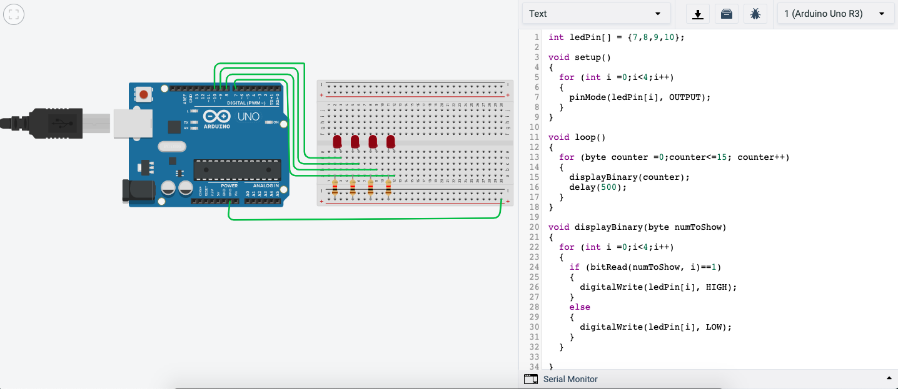

# Comsci-Isak-unit-2
This is for all the files and work done for unit 2
Interplanetary Communication
===========================

An application that helps different planets communicate

Contents
-----
  1. [Planning](#planning)
  1. [Design](#design)
  1. [Development](#development)
  1. [Evalution](#evaluation)

Planning
----------
The clients are astronauts. They are currently doing research on the plants Mars and moon. They need to communicate to relay information of what they have discovered on these planets. The signal they have is very limited and slow. In order to adapt to this and communicate they have to use the use different languages to send codes that are short and able to be deciphered. 

The application has to allow for the follwing:
- Communication between Earth and Mars uses Morse code.
- Communication between Mars and the Moon uses Binary code.
- Provide a communication system that allow stations to communicate seamlessly using English.
Keyboard input on each station is limited to 2 push buttons. 
100W lights are buzzers are available.


### Rationale for proposed solution
Since they have to use easy and decipherable languages. We have proposed to use Morse and binary code. We are using Arduino because it is able to use these languages and translate them using LED's using the code. Arduino allows us to make code translating between the languages and also implement the code into a circuit which will then allow these astronauts to communicate. The reason as to why we are using Arduino is because Arduino software runs on Windows, Macintosh OSX, and Linux operating systems so most computer softwares can run it. Arduino's are also relatively cheap so they reduce the cost for this program to run. 

### Success Criteria
This are measuarable outcomes
1. 2 Push Buttons allow the user to communicate 
2. The system allows Morse to be translated into English with the use of lights.
3. The system allows Binary to be translated into Morse with the use of lights.
4. The system uses 100W lights for communication
5. The buttons allow for Sending, Deleting, Spacing, and digit's as well

Design
--------


**Figure 1:** The Diagram above shows the hardware and software components for our system

We have been tasked with Planet Earth, what that means is that we will be translating and receiving English and Morse. We will have to be able to Receive both Morse and English and translate them both using buttons as keyboards and LED's as signal for other planets to receive. We have dropped the task of Binary code as it appears to be very difficult.

Development
--------
Describe the process needed to convert a number from Binary to Decimal:

1. Make a table for 8 spaces and in those spaces put the multiples of 2 starting at 1, from the right to the left.
2. With a binary number, align it with the tables of multiples of 2
3. If the binary number digit is 1, write the corresponding number from the multiples of 2 table below the digit
4. If the binary number digit is 0, then just write 0 below the digit
5. Add all the digits below the binary numbers

we used TinkerCad to simulate the use of 4 LED's to count in binary from 1 to 15.


How to count from 0 - 15 in binary

When we run out of digits, we start back at 0 again, but add 1 on the left.

We learned how to allow LED's to be turned on and off using push buttons


```
int butA = 10;
int butB = 11;
int out1 = 3;
int out2 = 4;

void setup()
{
  Serial.begin(9600);
  pinMode(butA, INPUT);
  pinMode(butB, INPUT);
  pinMode(out1, OUTPUT);
  pinMode(out2, OUTPUT);
}

void loop()
{
  
  int A=digitalRead(butA);
  int B=digitalRead(butB);
  
  if(A== 0 && B == 0){
    digitalWrite(out1, HIGH);
    digitalWrite(out2, LOW);
  }
  if(A== 0 && B == 1){
    digitalWrite(out1, LOW);
    digitalWrite(out2, HIGH);
  }
  if(A== 1 && B == 0){
    digitalWrite(out1, LOW);
    digitalWrite(out2, HIGH);
  }
  if(A== 1 && B == 1){
    digitalWrite(out1, LOW);
    digitalWrite(out2, LOW);
  }
}
```
We had to define the different outputs and inputs, The inputs being butA and butB, which are 10 and 11, as you can see the the green wires connect butA and B to the Arduino UNO on number 10 and 11. The outputs are the 2 LED's which are connected via the yellow and blue wire to number 3 and 4. The LOW means that the LED is off and the HIGH means that the LED is on. 

In class we practiced our skills to make truth tables to display the number 0-7 using led's, here is my work on the truth tables, unfortunately I could not get to the point to code it and practice it


We developed a code to allow the user to input English letters and digits using 2 buttons

```
// add the comments to the header of the program
//This code allows the user to type digit & alphabets using two buttons and gives them the option to send and delete.
String text = "";
int index = 0; 
// add all the letters and digits to the keyboard
String keyboard[]={"A", "B", "C", "D", "E", "F", "G", "H", "I", "J", "K", "L", "M", "N", "O", "P", "Q", "R", "S", "T", "U", "V", "W", "X", "Y", "Z", "1", "2", "3", "4", "5", "6", "7", "8", "9", "0", "SENT", "DEL",};
int numOptions = 38; //size of keyboard

void setup()
{
  Serial.begin(9600);
  attachInterrupt(0, changeLetter, RISING);//button A in port 2
  attachInterrupt(1, selected, RISING);//button B in port 3
}

void loop()
{
  Serial.println("Option (Select:butB, Change:butA): " + keyboard[index]);
  Serial.println("Message: "+ text);
  delay(1000);
}

//This function changes the letter in the keyboard
void changeLetter(){
index++;
//Explain what the functionality of the if condition below 
// The if command here shows that when the loop of letters and numbers are finished; when it cycles through 38 options; it goes back and restarts at 0
  if(index>numOptions){
  	index=0; //loop back to first row
  } 
}

//this function adds the letter to the text or send the msg
void selected(){
  //include the program here represented in the flow diagram in   Fig. 2
String key = keyboard[index];
if(key =="DEL"){
int len= text.length(); text.remove(len-1);
  index=0;}
else if(key=="SEND"){
Serial.println("Message Sent");
text="";
}
else(text += key);{
}
}
```
The way this code works is that the there is an array of letter, digits and options, the buttons allow us to select the them and switch. The code will loop the array and when a button is pressed it goes to the next option until all the options are gone through then it restarts at the first option. 
** Update: the code was looping too fast for me so i increased the delay to 1000.


### English To Morse System

Firstly, we had to decide what kind of system would our application be. There were a few ideas here and there and so we decided to make a pros and cons diagram to decide.


**Figure 2:** The table aboves displays our thought process, in the end we decided to use the 2 light system.

We were deciding between using a time based sytem or using 2 lights. What the diagram says basically is that time based system is much easier to code but a hassle for the client and other planets to understand. So we went ahead and decided to use the 2 lights system.

**Protocols**
Protocals are a standard set of rules that allow electronic devices to communicate with each other. These rules include what type of data may be transmitted, what commands are used to send and receive data, and how data transfers are confirmed.
In our program to communicate with other planets, protocals are essential in order to communicate effectively and avoid misinterpretations and misunderstandings.


**Figure 3:** The table above are some examples of different protocols used on the internet that we learned in class


I have come up with several protocals:
1. 1 Light rapidly blinks when wanting to communicate with another planet.
2. Light stays off when not in use or the end of a message.
3. Between Earth and Mars the light blinks at a speed of 0.2 seconds in between blinks.
4. Between Mars and Moon the light blinks at a speed of 1 second in between blinks.
5. 1 light on from receiving planet when signal is understood and message is ready to be received.
6. Both lights on from receiving planet when message is received and understood.

**Update We have agreed to use the following protocol for our system:**
1. A dot means you light the light for one second (light on)
2. A dash is three seconds (light on) 
3. Between parts of letter is one second (light off)
4. Between letters is two second (light off)
5. Between words is 4 seconds (light off)
6. Indicate the beginning and end of a message it’ll flash five times (for half a second per flash) (light on

**Code Development**
The following is the code for the English to Morse Translation
```.c
// include the library code:
#include <LiquidCrystal.h>
int index = 0; 
// add all the letters and digits to the keyboard
String keyboard[]={"A", "B","SENT", "MORSE", "C", "D", "E", "F", "G", "H", "I", "J", "K", "L", "M", "N", "O", "P", "Q", "R", "S", "T", "U", "V", "W", "X", "Y", "Z", "DEL"};
String text = "";
int numOptions = 28;
int i = 0;

// initialize the library with the numbers of the interface pins
LiquidCrystal lcd(12, 11, 5, 4, 9, 8);

void setup() {
  Serial.begin(9600);
  pinMode(13, OUTPUT);
  pinMode(10, OUTPUT);
  // set up the LCD's number of columns and rows:
  lcd.begin(16, 2);
  // Print a message to the LCD.
  attachInterrupt(0, changeLetter, RISING);//button A in port 2
  attachInterrupt(1, selected, RISING);//button B in port 3
}

void loop() {
  // set the cursor to column 0, line 1
  // (note: line 1 is the second row, since counting begins with 0):
  lcd.clear();
  lcd.setCursor(0, 0);
  lcd.print(keyboard[index]);
  lcd.setCursor(0, 1);
  lcd.print(text);
  delay(100);
}

//This function changes the letter in the keyboard
void changeLetter(){
  static unsigned long last_interrupt_time = 0;
  unsigned long interrupt_time = millis();
  if (interrupt_time - last_interrupt_time > 200)
  {
  
    last_interrupt_time = interrupt_time;// If interrupts come faster than 200ms, assum
    index++;
      //check for the max row number
    if(index==numOptions){
      index=0; //loop back to first row
    } 
 }
}

//this function adds the letter to the text or send the msg
void selected(){
  static unsigned long last_interrupt_time = 0;
  unsigned long interrupt_time = millis();
  if (interrupt_time - last_interrupt_time > 200)
  {
  
    last_interrupt_time = interrupt_time;// If interrupts come faster than 200ms, assum
    
    String key = keyboard[index];
    if (key == "DEL")
    {
      int len = text.length();
      text.remove(len-1);
    }
    else if(key == "SENT")
    {
      sent();
      text="";
    }
    else{
      text += key;
    }
    index = 0; //restart the index
  }
}
 
void sent() {
  Serial.print("begin ");
      
int strLen = text.length(); // setting len to length to text
for (int i = 0; i < strLen; i++) {  // cycling through each letter of text 
  switch (text.charAt(i)) { // translating for i’th letter
 
case 'A':
  dot();
  dash();
  wait();
  break;
case 'B':
  dash();
  dot();
  dot();
  dot();
  wait();
  break;
case 'C': 
  dash();
  dot();
  dash();
  dot();
  wait();
  break;
case 'D':
  dash();
  dot();
  dot();
  wait();
  break;
case 'E':
  dot();
  wait();
  break;
case 'F': 
  dot();
  dot();
  dash();
  dot();
  wait();
  break;
case 'G':
  dash();
  dash();
  dot();
  wait();
  break;
case 'H':
  dot();
  dot();
  dot();
  dot();
  wait();
  break;
case 'I':
  dot();
  dot();
  wait();
  break;
case 'J':
  dot();
  dash();
  dash();
  dash();
  wait();
  break;
case 'K':
  dash();
  dot();
  dash();
  wait();
  break;
case 'L':
  dot();
  dash();
  dot();
  dot();
  wait();
  break;
case 'M':
  dash();
  dash();
  wait();
  break;
case 'N':
  dash();
  dot();
  wait();
  break;
case 'O':
  dash();
  dash();
  dash();
  wait();
  break;
case 'P':
  dot();
  dash();
  dash();
  dot();
  wait();
  break;
case 'Q':
  dash();
  dash();
  dot();
  dash();
  wait();
  break;
case 'R':
  dot();
  dash();
  dot();
  wait();
  break;
case 'S':
  dot();
  dot();
  dot();
  wait();
  break;
case 'T':
  dash();
  wait();
  break;
case 'U':
  dot();
  dot();
  dash();
  wait();
  break;
case 'V':
  dot();
  dot();
  dot();
  dash();
  wait();
  break;
case 'W':
  dot();
  dash();
  dash();
  wait();
  break;
case 'X':
  dash();
  dot();
  dot();
  dash();
  wait();
  break;
case 'Y':
  dash();
  dot();
  dash();
  dash();
  wait();
  break;
case 'Z': 
  dash();
  dash();
  dot();
  dot();
  wait();
  break; 
case ' ':
  digitalWrite(13, LOW);
  delay(4000);
if (i < strLen - 1) { 
 Serial.print("done");
  // for (int i = 0; i < 7; i++) { // blink light five times to indicate beginning of message
 // digitalWrite(13, HIGH);
 // delay(300);
 // digitalWrite(13, LOW);
 // delay(300); }
} 
  }}}

void dot() {  // defining the dot function as one light being ON for one second 
Serial.print("dot ");
digitalWrite(13, HIGH);
delay(1000);
digitalWrite(13, LOW);
delay(1000);
}

void dash() { // defining the dash function as the light being on for three seconds
Serial.print("dash ");
digitalWrite(13, HIGH);
digitalWrite(10, HIGH);
delay(3000);
digitalWrite(13, LOW);
digitalWrite(10, LOW);
delay(1000);
}

void wait() { // defining the wait function 
  delay(2000); // between letters is two second delay
} 
```
**Code Explanation**

We have already developed a code above to allow to input English letters with 2 Buttons.
With that There wasn't much left to add.
We needed a way capable to translate the english input into Morse code.
 
```.c
 else if(key == "SENT")
    {
      sent();
      text="";
```
The code above ;key "Sent"; will redirect the program to another fucntion (sent)    
```.c      
void sent() {
  Serial.print("begin ");
      
int strLen = text.length(); // setting len to length to text
for (int i = 0; i < strLen; i++) {  // cycling through each letter of text 
  switch (text.charAt(i)) { // translating for i’th letter
```
The function above is a for loop that cycles through each letter in the String Keyboard, Then it compares the letter and the actions needed to be performed for that later, for that a switch case is used.
A switch case allows programmers to specify different code that should be executed in various conditions.
```.c
case 'Z': 
  dash();
  dash();
  dot();
  dot();
  wait();
  break; 
```
The code above is an example of a case for the letter Z. it includes the functions needed to display the letter Z in Morse using lights.

```.c
void dot() {  // defining the dot function as one light being ON for one second 
Serial.print("dot ");
digitalWrite(13, HIGH);
delay(1000);
digitalWrite(13, LOW);
delay(1000);
}

void dash() { // defining the dash function as the light being on for three seconds
Serial.print("dash ");
digitalWrite(13, HIGH);
digitalWrite(10, HIGH);
delay(3000);
digitalWrite(13, LOW);
digitalWrite(10, LOW);
delay(1000);
}

void wait() { // defining the wait function 
  delay(2000); // between letters is two second delay
} 
```
These are the functions of Dot, dash and wait, which gives instructionsto the lights. These were used to reduce lines of code of the program and decreases work load.

**Code Development**
The following is the code for the Morse to English Translation

```.c
// include the library code:
#include <LiquidCrystal.h>
int index = 0; 
String keyboard[]={".-", "-...","-.-.", "-..", ".", "..-.", "--.", "....", "..", ".---", "-.-", ".-..", "--", "-.", "---", ".--.", "--.-", ".-.", "...", "-", "..-", "...-", ".--", "-..-", "-.--", "--..", "RESET", "DEL"};
String text = "";
String chosen = "";
int numOptions = 29;
int i = 0;

// initialize the library with the numbers of the interface pins
LiquidCrystal lcd(12, 11, 5, 4, 9, 8);

void setup() {
  Serial.begin(9600);
  pinMode(13, OUTPUT);
  pinMode(10, OUTPUT);
  // set up the LCD's number of columns and rows:
  lcd.begin(16, 2);
  // Print a message to the LCD.
  attachInterrupt(0, changeLetter, RISING);//button A in port 2
  attachInterrupt(1, selected, RISING);//button B in port 3
}

void loop() {
  // set the cursor to column 0, line 1
  // (note: line 1 is the second row, since counting begins with 0):
  lcd.clear();
  lcd.setCursor(0, 0);
  lcd.print(keyboard[index]);
  lcd.setCursor(0, 1);
  lcd.print(chosen); // CHANGE TEXT TO TRANSLATED
  delay(100);
}

//This function changes the letter in the keyboard
void changeLetter(){
  static unsigned long last_interrupt_time = 0;
  unsigned long interrupt_time = millis();
  if (interrupt_time - last_interrupt_time > 200)
  {
  
    last_interrupt_time = interrupt_time;// If interrupts come faster than 200ms, assum
    index++;
      //check for the max row number
    if(index==numOptions){
      index=0; //loop back to first row
    } 
 }
}

//this function adds the letter to the text or send the msg
void selected(){
  static unsigned long last_interrupt_time = 0;
  unsigned long interrupt_time = millis();
  if (interrupt_time - last_interrupt_time > 200)
  {
  
    last_interrupt_time = interrupt_time;// If interrupts come faster than 200ms, assum
    
    String key = keyboard[index];
    if (key == "DEL")
    {
      int len = text.length();
      text.remove(len-1);
    }
    else if (key == "RESET")
    {
      chosen = "";
    }
    else{
      text += key;
      convert();
    }
    index = 0; //restart the index
  }
}

void convert() {
  Serial.print("Starting conversion");
  lcd.setCursor(0, 1);
  if (text == ".-" ) {
    String key = "A"; 
    chosen += key;
  }
  else if (text == ".-" ) {
    String key = "B"; 
    chosen += key;
  }
  else if (text == "-.-.") {
    String key = "C"; 
    chosen += key;
  }
  else if (text == "-..") {
    String key = "D"; 
    chosen += key;
  }
  else if (text == ".") {
    String key = "E"; 
    chosen += key;
  }
  else if (text == "..-.") {
    String key = "F"; 
    chosen += key;
  }
  else if (text == "--.") {
    String key = "G";
    chosen += key;    
  }
  else if (text == "....") {
    String key = "H"; 
    chosen += key;
  }
  else if (text == "..") {
    String key = "I"; 
    chosen += key;
  }
  else if (text == ".---") {
    String key = "J"; 
    chosen += key;
  }
  else if (text == "-.-") {
    String key = "K"; 
    chosen += key;
  }
  else if (text == ".-..") {
    String key = "L"; 
    chosen += key;
  }
  else if (text == "--") {
    String key = "M"; 
    chosen += key;
  }
  else if (text == "-.") {
    String key = "N"; 
    chosen += key;
  }
  else if (text == "---") {
    String key = "O"; 
    chosen += key;
  }
  else if (text == ".-" ) {
    String key = "P"; 
    chosen += key;
  }
  else if (text == "-.-.") {
    String key = "Q"; 
    chosen += key;
  }
  else if (text == "-..") {
    String key = "R"; 
    chosen += key;
  }
  else if (text == ".") {
    String key = "S"; 
    chosen += key;
  }
  else if (text == "..-.") {
    String key = "T"; 
    chosen += key;
  }
  else if (text == "--.") {
    String key = "U"; 
    chosen += key;
  }
  else if (text == "...-") {
    String key = "V"; 
    chosen += key;
  }
  else if (text == ".--") {
    String key = "W"; 
    chosen += key;
  }
  else if (text == "-..-") {
    String key = "X"; 
    chosen += key;
  }
  else if (text == "-.--") {
    String key = "Y";
    chosen += key;
  }
  else if (text == "--..") {
    String key = "Z";
    chosen += key; 
  }
  text = "";
}
```
**Code Explanation**

The code for Morse to English is much easier after completing the English to Morse translation.

```.c
String keyboard[]={".-", "-...","-.-.", "-..", ".", "..-.", "--.", "....", "..", ".---", "-.-", ".-..", "--", "-.", "---", ".--.", "--.-", ".-.", "...", "-", "..-", "...-", ".--", "-..-", "-.--", "--..", "RESET", "DEL"};
```
Firstly we had to change the string Keyboard to Morse.

```.c
 void convert() { 
  if (text == ".-" ) {
    String key = "A";
    chosen += key;
  }
  text = ""; 
}
```
The code above, similar to a switch case, it compares the letter and the actions needed to be performed for that letter. For this program we found it difficult to use switch case and decided to use if statements.

**Code Testing** 


This test is made to ensure the program and all it's options work properly, it tests the ability to input letters, translate letters, delete letters, and clear a row.

This is video evidence of the test

[https://www.youtube.com/watch?v=nQMU-dAM5Pw&list=PLS6syomu_xC6TR8MhTaBuTHIIJVKAyJ-w&index=3&t=0s]


This test is made to ensure that it is able to input and display letters, use lights to display it in morse, and delete letters,

This is video evidence of the test

[https://www.youtube.com/watch?v=HkToqDY9gbA&list=PLS6syomu_xC6TR8MhTaBuTHIIJVKAyJ-w&index=1]

Evaluation
----------


From this we can conclude that the the program is mostly successful. What kept it from reaching it's full potential is the exclusion of Binary and the disability of using spaces.

**Further Improvements**

Despite being mostly successful, It is incredibly slow to translate words and decipher words. It is really inefficient. That is due to the amount of time it takes to reach a wanted letter and then sending/deleting it.  This probably where a time based solution would shine, increasing the time of intervals for switching letters could save much time. This could also be resolved by increasing number of buttons/inputs for the system. Another solution could be using autocorrect or a suggesting software where it would suggest words for the user and offer autocorrect for a misspelled letter. 

After making the English to Morse Program we tried to make both integrate both programs into one but unfortunately didn’t have the time figure that out, but if both programs were together then it would increase the efficiency, resulting in less people needed to man the program. 


## References
“MultiWingSpan.” Multiwingspan, http://www.multiwingspan.co.uk/arduino.php?page=led5.

Person, and wikiHow. “How to Convert from Binary to Decimal.” WikiHow, WikiHow, 12 Nov. 2019, https://www.wikihow.com/Convert-from-Binary-to-Decimal. 

Binary Number System, Math Is Fun, https://www.mathsisfun.com/binary-number-system.html.

Christensson, Per. "Protocol Definition." TechTerms. Sharpened Productions, 29 March 2019. Web. 07 January 2020. <https://techterms.com/definition/protocol>.

“Switch...case.” Arduino Reference, www.arduino.cc/reference/en/language/structure/control-structure/switchcase/.
